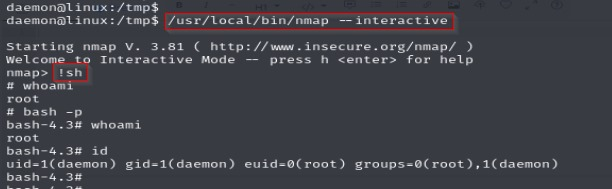

# Project Overview

## Description

¿Un gestor de contenidos Wordpress y uso de credenciales débiles? 

Una muy mala combinación.

Basado en el programa Mr. Robot, un nuevo reto para los alumnos de HackerMentor el cual se enfrentan a una de las ultimas maquina virtuales Robot.

# Executive Summary

Esta VM tiene tres banderas ocultas en diferentes ubicaciones. Tu objetivo es encontrar las tres. Cada bandera es progresivamente difícil de encontrar.

Bandera 1 --> b8a2bd7f70b405df8823bd4442892c6c
Bandera 2 --> c6ad356a6d4ab0c2c9d033caadf28469
Bandera 3 -> 6c6b1c7089af9c9bb7ac78f06c3c1685

La VM no es demasiado difícil. No existe ninguna explotación avanzada ni ingeniería inversa. El nivel se considera principiante-intermedio.

En la etapa inicial de la evaluación de la máquina "Robot", se realizó un minucioso análisis empleando la herramienta "Nmap" con el objetivo de detectar los puertos y servicios disponibles en el sistema y detectar posibles vulnerabilidades susceptibles de ser aprovechadas. A continuación, se presentan de manera resumida los resultados clave de este escaneo:

Detección de Puertos Abiertos: "Robot" mostró un total de tres puertos en estado abierto, cada uno de ellos asignado a servicios específicos en la máquina. El primer puerto se corresponde con el servicio SSH, utilizado para la gestión segura del sistema. Los dos puertos restantes estaban relacionados con un servidor web "Apache", uno de los cuales tenía habilitada la capa de seguridad SSL (Secure Sockets Layer), mientras que el otro no contaba con esta capa de protección.

Exploración del archivo "robots.txt": Se confirmó la existencia del archivo "robots.txt". Como resultado, se encontraron dos archivos adicionales que se consideraron potencialmente relevantes para la evaluación.

Estos hallazgos iniciales sentaron las bases para una exploración más exhaustiva y la identificación de vulnerabilidades específicas, las cuales fueron posteriormente tratadas y aprovechadas con el propósito de mejorar la seguridad y comprender mejor la máquina "Robot".

**AUTOR DEL REPORTE : JONATHAN JESUS JACINTO BADILLO**

## Summary of Findings Identified

| Prioridad | Vulnerabilidad                                            |
|-----------|-----------------------------------------------------------|
| **# 1 Critical** | Dirty cow                                  |
| **# 2 High**     | Vulnerabilidad de Edición de Temas No Autorizada |
| **# 3 Critical** | Vulnerabilidad de Información Incorrecta en Mensajes de Error en WordPress |
| **# 4 High**     | nft_object UAF (NFT_MSG_NEWSET)              |
| **# 5 High**     | Explotación de Permisos Privilegiados en Nmap |
| **# 6 Medium**   | xorg-x11-server                            |
| **# 7 Medium**   | OpenSSL AES-NI                             |
| **# 8 Low**      | Service Detection                           |
| **# 9 Info**     | SSL / TLS Versions Supported                |
| **# 10 Info**    | HSTS Missing From HTTPS Server              |

## Scope

### In Scope

Ataque DDOS
Posible modificaciòn del sistema
Machine Robot
Acceso al sistema
Acceso con Privilegios elevados
Detectar vulnerabilidades en los servicios, principalmente en WordPress CMS sistema de gestiòn de contenidos
Mantener el sistema con su configuraciòn por defecto

### Out of Scope

Ataques de denegación de servicio (DoS): Los ataques de denegación de servicio no serán considerados en esta evaluación, ya que pueden ocasionar perturbaciones significativas en los servicios y sistemas.

La evaluación se restringe exclusivamente a la máquina "Robot" en sí, y no abarca la exploración o explotación de sistemas ajenos o no relacionados, como las máquinas Bolt, Navigator, o cualquier otro sistema que pueda encontrarse en la red.

Cualquier actividad ilícita o contraria a principios éticos, como la revelación de información personal, está terminantemente excluida de este proceso.

La evaluación debe ejecutarse dentro de los límites establecidos por Hacker Mentor y en conformidad con las políticas de seguridad de la empresa.

## Methodology

**OSSTMM** 
El marco OSSTMM, uno de los estándares más reconocidos en la industria, proporciona una metodología científica para pruebas de penetración de redes y evaluación de vulnerabilidades.

Fase de Configuración:
En esta etapa, configura tu entorno de evaluación de manera adecuada, asegurándote de disponer de todas las herramientas y recursos esenciales para llevar a cabo la evaluación.

Fase de Prueba:
En esta fase, lleva a cabo el escaneo de la red y el análisis de las vulnerabilidades. Utiliza herramientas como "Nmap" y exploradores de vulnerabilidades para detectar puertos abiertos y posibles debilidades. Asimismo, realiza un análisis de los servicios, enumerándolos y evaluándolos en busca de posibles vulnerabilidades. Además, realiza pruebas éticas de explotación con el fin de aprovechar vulnerabilidades conocidas o recién descubiertas para acceder al sistema y cumplir los objetivos, como la búsqueda de banderas.

Fase de Informe:
En esta etapa, documenta tus descubrimientos registrando con detalle todas las vulnerabilidades identificadas, las acciones tomadas y los archivos de banderas localizados. Elabora un informe completo que incluya una descripción de las vulnerabilidades, su gravedad, los pasos seguidos para explotarlas y cualquier recomendación para mitigar los riesgos. Asegúrate de respaldar tus hallazgos con pruebas concretas, como capturas de pantalla o registros de actividad.

Fase de Limpieza y Restauración:
En esta fase final, restaura el sistema a su estado original, eliminando cualquier modificación no autorizada que haya ocurrido durante la evaluación.

## Recommendations

La máquina "Robot" hospeda un servicio WordPress que no ha sido actualizado y, como resultado, presenta numerosas vulnerabilidades que son susceptibles de ser explotadas. La mayoría de estas vulnerabilidades se deben a la falta de actualizaciones del sistema y a prácticas deficientes de administración de permisos. Además, existe un riesgo de filtración de información relevante a través de los servicios web, lo que podría permitir a usuarios no autorizados acceder a esta información de manera sencill.

Por esta razon urge realizar las siguientes recomendaciones para mitigar estas vulnerabilidades del sistema: 

**Mantenimiento de Software al Día**: Se sugiere mantener todos los programas actualizados, incluyendo el sistema operativo, WordPress y sus componentes, para mitigar riesgos de seguridad.

**Política de Contraseñas Sólidas**: Implementar una política de contraseñas fuertes para usuarios y cuentas de servicios para prevenir accesos no autorizados.

**Gestión de Usuarios Eficiente**: Es importante revisar la lista de usuarios y eliminar aquellos que no son necesarios para reducir las posibilidades de intrusiones.

**Auditoría de Usuarios y Acceso**: Se aconseja establecer una auditoría continua de usuarios y accesos para detectar actividad sospechosa.

**Monitorización de Seguridad**: Implementar un sistema de monitorización que registre y alerte sobre acciones inusuales o intentos de intrusión.

**Revisiones Regulares**: Enfatizar la necesidad de realizar auditorías periódicas para evaluar la efectividad de las medidas de seguridad y detectar nuevas vulnerabilidades.

**Educación en Seguridad**: Proveer capacitación en seguridad cibernética a usuarios y personal para promover prácticas seguras.

**Parches de Seguridad**: Asegurarse de aplicar los parches de seguridad y seguir las recomendaciones específicas de seguridad de WordPress.

**Plan de Respuesta a Incidentes**: Desarrollar un plan de respuesta detallado para actuar en caso de una violación de seguridad.

**Documentación y Políticas**: Registrar todas las medidas de seguridad y políticas de seguridad en un lugar accesible y actualizado.

# Findings and Risk Analysis

## Dirty cow

**Severity:** Critical

**CVSS Score:** 8.7 (CVSS:3.1/AV:L/AC:L/PR:L/UI:N/S:C/C:H/I:L/A:H)

**CWE:** 378 - Creation of Temporary File With Insecure Permissions

**Description**

Dirty COW (Dirty Copy-On-Write), es una vulnerabilidad crítica que afecta al kernel de Linux. Esta vulnerabilidad permite a un atacante local o malicioso obtener privilegios de escritura no autorizados en áreas de memoria de solo lectura del kernel. Al explotar esta vulnerabilidad, un atacante puede potencialmente ejecutar código malicioso con privilegios de administrador en un sistema Linux comprometido o realizar cambios no autorizados en el sistema. El nombre &quot;Dirty COW&quot; proviene de la técnica de &quot;copy-on-write&quot; utilizada en sistemas operativos para gestionar la memoria compartida.

Esta vulnerabilidad se considera crítica debido a su capacidad para comprometer sistemas Linux, especialmente en entornos multiusuario y servidores. Los ataques exitosos pueden permitir a los atacantes obtener control total sobre el sistema, lo que podría tener consecuencias graves para la seguridad y la integridad de los datos.

**Location**

kernel de Linux

**Impact**

* Un usuario local sin privilegios podría utilizar esta falla para obtener acceso de escritura a asignaciones de memoria que de otro modo serían de solo lectura y así aumentar sus privilegios en el sistema.

* Esta falla permite que un atacante con una cuenta de sistema local modifique archivos binarios en el disco, evitando los mecanismos de permisos estándar que impedirían la modificación sin un conjunto de permisos adecuado.

**Recommendation**

1. Para mitigar la vulnerabilidad CVE-2016-5195 (Dirty COW) y garantizar la seguridad de un sistema Linux, se proponen las siguientes medidas:

2. Actualización del Kernel: La actualización del kernel a la versión más reciente es esencial para corregir la vulnerabilidad. Esto es necesario porque los desarrolladores de Linux han emitido parches que solucionan la vulnerabilidad Dirty COW y proporcionan una mayor seguridad al sistema.

3. Reinicio del Sistema: Después de aplicar la actualización del kernel, se debe reiniciar el sistema para que los cambios surtan efecto. Esto garantiza que la vulnerabilidad se elimine y que el sistema esté protegido.

4. Supervisión Continua y Revisiones Regulares: La implementación de un monitoreo constante es fundamental para detectar cualquier actividad sospechosa en el sistema. Las revisiones regulares permiten identificar posibles indicadores de compromiso y tomar medidas preventivas oportunas.

5. Plan de Respuesta a Incidentes: Es esencial tener un plan de respuesta a incidentes en su lugar para abordar cualquier compromiso de seguridad potencial. Esto incluye procedimientos para investigar, contener y mitigar posibles ataques, y debe estar disponible para su implementación inmediata en caso de ser necesario.

6. Estas medidas brindan una solución integral para abordar CVE-2016-5195 (Dirty COW) y proteger el sistema contra amenazas conocidas y desconocidas. La justificación destaca la importancia de cada paso en la mitigación de la vulnerabilidad y garantiza la seguridad del sistema durante el proceso de auditoría de pentesting.

**References**

https://bugzilla.redhat.com/show_bug.cgi?id=1384344
    https://access.redhat.com/security/vulnerabilities/2706661
    https://plus.google.com/+KeesCook/posts/UUaXm3PcQ4n
    https://twitter.com/nelhage/status/789196293629370368
    https://bugzilla.suse.com/show_bug.cgi?id=1004418#c14

## Vulnerabilidad de Edición de Temas No Autorizada

**Severity:** High

**CVSS Score:** 8.4 (CVSS:3.1/AV:N/AC:H/PR:L/UI:N/S:C/C:H/I:H/A:L)

**CWE:** 598 - Use of GET Request Method With Sensitive Query Strings

**Description**

Esta amenaza de seguridad que afecta a sitios web que utilizan el sistema de gestión de contenidos WordPress. Esta vulnerabilidad permite que usuarios no autorizados, con acceso a la sección de edición de temas y páginas, realicen cambios en el código fuente del sitio de manera no autorizada. Esto puede dar lugar a la inyección de código malicioso en el sitio, lo que permite a un atacante ejecutar código arbitrario en el servidor web subyacente. La explotación exitosa de esta vulnerabilidad podría comprometer la integridad y seguridad del sitio, lo que puede llevar a consecuencias graves, como la toma completa del sitio o la divulgación de información sensible.

**Location**

http://192.168.3.152/wp-admin/theme-editor.php?file=404.php&amp;theme=twentyfifteen

**Impact**

La vulnerabilidad de inyección de código en la edición de temas y páginas de WordPress podría tener varios impactos en la máquina y el sitio web afectado:

1. Compromiso de la Integridad del Sitio: Los atacantes podrían modificar el código fuente del sitio web para incluir contenido malicioso, enlaces a sitios web dañinos o realizar cambios no autorizados en la apariencia y el funcionamiento del sitio.

2. Ejecución de Código Malicioso: Al inyectar código malicioso, los atacantes podrían ejecutar scripts arbitrarios en el servidor web subyacente, lo que podría permitirles tomar el control del sitio web y, en última instancia, del servidor.

3. Divulgación de Información Sensible: Dependiendo de la naturaleza del sitio web, la vulnerabilidad podría exponer información sensible o confidencial a los atacantes, lo que podría tener serias implicaciones para la privacidad y seguridad de los datos.

4. Daño a la Reputación: Si un atacante logra alterar el contenido del sitio o realizar acciones destructivas, podría dañar la reputación del sitio y su confianza entre los visitantes y usuarios.

5. Pérdida de Datos: En casos extremos, la explotación de esta vulnerabilidad podría resultar en la pérdida de datos, incluidos archivos y configuraciones críticas.

El impacto real depende de la gravedad de la explotación y de cómo se utilice la vulnerabilidad. Por lo tanto, es crucial abordar y corregir esta vulnerabilidad para prevenir posibles consecuencias negativas.

**Proof of Concept**

-Editor WordPress con disponibilidad de edicion para las busquedas no encontradas (404 template)

-Inyecciòn de codigo para obtener una shell reverse por el puerto 8002

-Aplicaciòn del codigo inyectado

-Puerto en escucha

-Pagina web deberia devolver 404 NOT FOUND, pero al cambiar el codigo ejecuta nuestra reverse shell cada vez que se haga una busqueda y no tenga exito

-Shell obtenida con usuario &quot;daemon&quot;

-Acceso al sistema exitoso!!!

**Recommendation**

Para este hallazgo se recomienda:

1. Actualización Inmediata: Se debe aplicar una actualización inmediata del sistema WordPress y de todos los complementos y temas a las últimas versiones seguras. Esto es esencial para eliminar las vulnerabilidades conocidas y mitigar los riesgos.

2. Control de Acceso: Implementar un control de acceso más estricto a la función de edición de temas y páginas. Limitar el acceso solo a usuarios autorizados y de confianza, como administradores.

3. Seguimiento de Cambios: Establecer un sistema de seguimiento y control de cambios para supervisar las modificaciones en el código del sitio. Esto ayudará a detectar actividad maliciosa y posibles inyecciones de código.

4. Seguridad de Código: Realizar auditorías de seguridad regulares en el código del sitio web para identificar vulnerabilidades y prácticas inseguras de programación. Utilizar herramientas de análisis estático de seguridad (SAST) para esta tarea.

5. Modo Solo Lectura: Establecer el modo &quot;solo lectura&quot; en los archivos de configuración del sitio para que los cambios no puedan realizarse directamente desde el panel de administración de WordPress.

6. Auditorías de Usuarios: Realizar auditorías periódicas de usuarios y sus roles en el sitio. Eliminar cuentas de usuario innecesarias y limitar los privilegios de acuerdo con el principio de &quot;menos privilegios&quot;.

7. Firewalls de Aplicaciones Web (WAF): Implementar un WAF para el sitio web que pueda detectar y bloquear ataques de inyección de código y otros ataques web comunes.

8. Educación de Usuarios: Capacitar a los usuarios y administradores en prácticas de seguridad web, como la creación de contraseñas sólidas y el reconocimiento de posibles amenazas.

9. Respuesta a Incidentes: Establecer un plan de respuesta a incidentes que detalle los pasos a seguir en caso de una intrusión o ataque exitoso. Esto garantizará una respuesta eficiente y una recuperación adecuada.

10. Monitoreo Continuo: Implementar un sistema de monitoreo continuo para detectar y responder a posibles amenazas en tiempo real.

**References**

https://codex.wordpress.org/es:
    https://github.com/pentestmonkey/php-reverse-shell#php-reverse-shell
    https://www.php.net/manual/en/index.php

## Vulnerabilidad de Información Incorrecta en Mensajes de Error en WordPress

**Severity:** Critical

**CVSS Score:** 8.3 (CVSS:3.1/AV:N/AC:L/PR:N/UI:R/S:U/C:H/I:L/A:H)

**CWE:** 7 - J2EE Misconfiguration: Missing Custom Error Page

**Description**

Vulnerabilidad en WordPress debido a una versión desactualizada que revela información de autenticación a través de mensajes de error, lo que podría llevar a un acceso no autorizado.

**Location**

locashost:80

**Impact**

La vulnerabilidad en WordPress debida a su falta de actualización tuvo un impacto potencialmente significativo en la seguridad y la confidencialidad del sistema. Permitió la revelación de información de autenticación, lo que podría llevar a accesos no autorizados y comprometer la integridad de los datos almacenados. Además, podría resultar en costos asociados para su mitigación y erosionar la confianza de los usuarios en el sistema. La actualización inmediata es esencial para minimizar estos riesgos.

**Proof of Concept**

-Ingreso al servicio WordPress de la maquina encontrado: http://192.168.3.152/wp-login.php, elaborando fuzzing de directorios
-Especificaciòn de usuario existente en el sistema CME

-Ataque de fuerza bruta con Wpscan
-Ataque exitoso!

**Recommendation**

Actualización Urgente: La actualización de WordPress a la última versión es esencial para remediar la vulnerabilidad. Esto incluye no solo el núcleo de WordPress, sino también temas y complementos. La actualización regular y automática debe habilitarse para garantizar que el sistema esté siempre protegido contra las últimas amenazas.

Configuración de Mensajes de Error: Se debería ajustar la configuración para evitar la exposición de información sensible en mensajes de error. Esto incluye ocultar detalles específicos de autenticación en mensajes de error, lo que dificultará a los atacantes obtener información sobre cuentas válidas.

Implementar Bloqueo de IP y Limitación de Intentos: Para prevenir ataques de fuerza bruta, se recomienda implementar un sistema de bloqueo de IP y limitación de intentos de inicio de sesión. Esto reducirá significativamente la probabilidad de que los atacantes tengan éxito.

Educación en Seguridad: La capacitación y concientización en seguridad son fundamentales. Los usuarios y administradores del sistema deben recibir formación sobre las mejores prácticas de seguridad, la creación de contraseñas sólidas y el reconocimiento de posibles amenazas.

Monitorización Activa y Respuesta a Incidentes: Debería establecerse un sistema de monitorización activa que identifique y alerte sobre actividades inusuales. Además, se debe desarrollar un plan de respuesta a incidentes para abordar las amenazas de manera rápida y eficiente.

**References**

https://wordpress.com/es/
    httpsÑ--wpscan.com-
    https://github.com/wpscanteam/wpscan
    https://fastweblaunch.com/blog/instale-wpscan-wordpress-security-scanner-en-ubuntu-20-04-lts/

## nft_object UAF (NFT_MSG_NEWSET)

**Severity:** High

**CVSS Score:** 7.8 (CVSS:3.1/AV:L/AC:L/PR:L/UI:N/S:U/C:H/I:H/A:H)

**CWE:** 9 - J2EE Misconfiguration: Weak Access Permissions for EJB Methods

**Description**

net/netfilter/nf_tables_api.c en el kernel de Linux hasta 5.18.1 permite a un usuario local (capaz de crear espacios de nombres de usuario/red) escalar privilegios a root porque una verificación NFT_STATEFUL_EXPR incorrecta conduce a un uso después de la liberación. (CVE-2022-32250)

**Location**

kernel de Linux hasta 5.18.1

**Impact**

El problema identificado se deriva de la secuencia de acciones realizadas en la función nft_set_elem_expr_alloc. Específicamente, el inconveniente se origina debido a que la función nft_expr_init se ejecuta antes de verificar si la expresión tiene la característica NFT_EXPR_STATEFUL. Este orden incorrecto tiene una consecuencia significativa: si se suministra una expresión que no incluye la característica NFT_EXPR_STATEFUL, la expresión se inicializa completamente y se añade al conjunto antes de que se evalúe su eliminación, lo que provoca la omisión de este paso crítico.

**Proof of Concept**

**Exploitation and Explanation:**

We have 2 exploits available for the vulnerability / POC:

@junomonster: https://github.com/theori-io/CVE-2022-32250-exploit

@Yordan: https://github.com/ysanatomic/CVE-2022-32250-LPE

I used the exploit created by @junomonster 

**The requirement to run the exploit:**

You need libmnl-dev and libnftnl-dev packages installed in your machine.

Affected Version

Linux, before commit 520778042ccca019f3ffa136dd0ca565c486cedd (26 May, 2022)

Ubuntu &lt;= 22.04 before security patch

**Test Environment**

Platform

Ubuntu 22.04 amd64

Versions

Linux ubuntu 5.12.0 #2 SMP Aug 18 14:17:41 JST 2023 x86_64 x86_64 x86_64 GNU/Linux

**Recommendation**

1. Actualización del Kernel: La actualización del kernel es esencial, ya que las actualizaciones suelen incluir correcciones para vulnerabilidades conocidas. Asegúrate de aplicar las últimas actualizaciones de seguridad disponibles para el kernel de tu sistema.

2. Control de Acceso y Supervisión: Implementar un control de acceso efectivo es fundamental. Esto incluye la administración de usuarios y permisos para limitar el acceso a áreas críticas del sistema y reducir el impacto de posibles ataques.

3. Revisión de las Reglas de NFTables: Es importante verificar que las reglas de NFTables estén configuradas correctamente para evitar la explotación de la vulnerabilidad. Puede ser necesario revisar y ajustar las configuraciones existentes.

4. Limitación de Privilegios: Restringir los privilegios de los usuarios, especialmente aquellos con la capacidad de crear espacios de nombres de usuario, es esencial. La vulnerabilidad se menciona como aprovechable por usuarios con dichos permisos, por lo que su limitación es crítica.

**References**

https://nvd.nist.gov/vuln/detail/cve-2022-32250
    https://access.redhat.com/security/cve/cve-2022-32250
    https://blog.theori.io/linux-kernel-exploit-cve-2022-32250-with-mqueue-a8468f32aab5

## Explotación de Permisos Privilegiados en Nmap

**Severity:** High

**CVSS Score:** 7.8 (CVSS:3.1/AV:L/AC:L/PR:L/UI:N/S:U/C:H/I:H/A:H)

**CWE:** 16 - Configuration

**Description**

En el transcurso de nuestra evaluación de seguridad, se presenció una explotación de permisos privilegiados en la herramienta Nmap, la cual tenía privilegios extendidos en el sistema de destino. Este episodio culminó con la obtención efectiva de un acceso root, lo que constituyó una amenaza importante para la seguridad global del entorno. Esta situación puso en evidencia la necesidad de mantener una gestión adecuada de la configuración de seguridad en las herramientas y servicios utilizados, así como subrayó la importancia de llevar a cabo auditorías y pruebas de penetración periódicas para identificar y solucionar potenciales debilidades.

**Location**

/usr/local/bin/nmap

**Impact**

El impacto de la escalada de privilegios en Nmap es de gran magnitud. Al lograr un acceso root en el sistema, se expuso una vulnerabilidad crítica que permitiría al atacante realizar acciones perjudiciales variadas, como la alteración de configuraciones, eliminación de datos o introducción de software malicioso. Esta situación debilita la integridad y confidencialidad del sistema, lo que amenaza tanto la seguridad de los datos como la estabilidad del entorno en su totalidad. También resalta la importancia de abordar prontamente las configuraciones de seguridad en las herramientas utilizadas y refuerza la necesidad de vigilancia continua y medidas preventivas para evitar futuros riesgos semejantes.

**Proof of Concept**

**Con acceso al sistema Robot**

**Recommendation**

1. Configuración Segura de Nmap: Garantice que Nmap se configure de manera que requiera los permisos mínimos y que no se ejecute con privilegios superiores a menos que sea estrictamente necesario. Esto disminuye la superficie de ataque y minimiza el riesgo de escalada de privilegios.

2. Auditorías Periódicas de Seguridad: Realizar evaluaciones regulares de seguridad para identificar y rectificar configuraciones incorrectas o inseguras en las herramientas empleadas, previniendo así futuras explotaciones de vulnerabilidades.

3. Pruebas de Penetración Continuas: Implementar evaluaciones de penetración de forma constante para descubrir posibles debilidades y vulnerabilidades antes de que puedan ser aprovechadas, reforzando la seguridad del sistema.

4. Mantenimiento de las Recomendaciones: Asegure que todas las recomendaciones se apliquen y mantengan a lo largo del tiempo, lo que implica revisiones regulares y ajustes de políticas y configuraciones según sea necesario para mantener un nivel constante de seguridad.

**References**

https://nmap.org/  
    https://gtfobins.github.io/gtfobins/nmap/#sudo
    https://book.hacktricks.xyz/generic-methodologies-and-resources/shells/full-ttys

## xorg-x11-server

**Severity:** Medium

**CVSS Score:** 6.6 (CVSS:3.1/AV:P/AC:L/PR:L/UI:N/S:U/C:H/I:H/A:H)

**CWE:** 5 - J2EE Misconfiguration: Data Transmission Without Encryption

**Description**

Se descubrió un problema en la versión de xorg-x11-server anterior a la 1.20.3. Esta vulnerabilidad se relaciona con una comprobación incorrecta de permisos en las opciones -modulepath y -logfile al iniciar el servidor Xorg. Como resultado, los usuarios sin privilegios que pueden iniciar sesión en el sistema a través de la consola física pueden aprovechar esta vulnerabilidad para elevar sus privilegios y ejecutar código malicioso con privilegios de administrador.

**Location**

/tmp/

**Impact**

* Acceso completo al sistema: El atacante tendría control total sobre la máquina y podría realizar acciones con privilegios de administrador.

* Compromiso de la integridad de las cuentas de usuario: Al acceder a &quot;master.passwd&quot;, el atacante podría modificar o eliminar cuentas de usuario, lo que afectaría la integridad de las credenciales y la seguridad de las cuentas.

* Pérdida de datos y confidencialidad: El atacante podría acceder a datos confidenciales almacenados en la máquina y, en última instancia, podría robar o eliminar información sensible.

* Posible daño a la disponibilidad del sistema: Dependiendo de las acciones realizadas por el atacante, el sistema podría quedar inoperable o su disponibilidad podría verse comprometida.

* Riesgo para la integridad del sistema: Al obtener privilegios de root, el atacante podría realizar modificaciones en el sistema que afecten su integridad y funcionamiento.

**Proof of Concept**

**Recommendation**

1. Actualización Crítica de Software: Priorice la actualización inmediata del servidor Xorg y otros componentes críticos del sistema. Asegúrese de que todas las aplicaciones y servicios estén en sus últimas versiones, ya que esta vulnerabilidad se ha parcheado en versiones más recientes.

2. Verificación Rigurosa de Permisos y Archivos Sensibles: Lleve a cabo una verificación minuciosa de los archivos sensibles en el sistema y sus permisos de acceso. Asegúrese de que solo los usuarios autorizados tengan acceso a estos archivos y que los permisos estén configurados de manera segura.

3. Implementación de Monitoreo Continuo: Establezca un sistema de monitoreo constante para detectar actividades anómalas en el sistema. Este monitoreo debería ser capaz de identificar posibles intentos de explotar vulnerabilidades de seguridad.

4. Restricción de Acceso Físico: Limite estrictamente el acceso físico a la máquina &quot;Robot&quot;. Solo el personal autorizado debe poder acceder a la consola física de la máquina para reducir el riesgo de explotación.

5. Plan de Respuesta a Incidentes: Desarrolle y ponga en práctica un plan de respuesta a incidentes que permita la recuperación y restauración del sistema en caso de una violación de seguridad. Esto debe incluir prácticas sólidas de copias de seguridad y procedimientos de recuperación.

**References**

https://www.exploit-db.com/exploits/45697
    https://nvd.nist.gov/vuln/detail/CVE-2018-14665
    httpsÑ--gist.github.com-0x27-d8aae5de44ed385ff2a3d80196907850

## OpenSSL AES-NI

**Severity:** Medium

**CVSS Score:** 6.0 (CVSS:3.1/AV:L/AC:H/PR:H/UI:N/S:U/C:H/I:H/A:L)

**CWE:** 5 - J2EE Misconfiguration: Data Transmission Without Encryption

**Description**

El sistema remoto está vulnerable a una brecha de seguridad que permite la divulgación de información a través de un ataque conocido como &#x27;man-in-the-middle&#x27; (MitM). Esta vulnerabilidad se debe a un error en la forma en que se aplican conjuntos de cifrado que utilizan AES en modo CBC junto con HMAC-SHA1 o HMAC-SHA256.

**Location**

OpenSSL

**Impact**

La implementación ha sido diseñada específicamente para aprovechar la aceleración AES presente en procesadores x86/amd64 (AES-NI). Los mensajes de error generados por el servidor crean una vulnerabilidad que habilita a un atacante intermedio a llevar a cabo un ataque de relleno de Oracle, lo que a su vez le permite descifrar el tráfico de la red.

**Recommendation**

1. Actualice a la versión OpenSSL 1.0.1t/1.0.2h o posterior.

**References**

https://blog.filippo.io/luckyminus20/
    http://www.nessus.org/u?7647e9f0
    https://www.openssl.org/news/secadv/20160503.txt

## Service Detection

**Severity:** Low

**CVSS Score:** 2.4 (CVSS:3.1/AV:N/AC:L/PR:H/UI:R/S:U/C:N/I:N/A:L)

**CWE:** 0 - Insufficient Information

**Description**

máquina remota al observar la información proporcionada en su banner o analizando la respuesta de error que genera al recibir una solicitud HTTP.

**Location**

http://192.168.3.152/

**Impact**

TBC

**Proof of Concept**

TBC

**Recommendation**

TBC

**References**

TBC

## SSL / TLS Versions Supported

**Severity:** Info

**CVSS Score:** 1

**CWE:** 0 - Insufficient Information

**Description**

Este complemento detecta qué versiones de SSL y TLS son compatibles con el servicio remoto para cifrar las comunicaciones.

## HSTS Missing From HTTPS Server

**Severity:** Info

**CVSS Score:** 1

**CWE:** 7 - J2EE Misconfiguration: Missing Custom Error Page

**Description**

El servidor HTTPS remoto no aplica la seguridad de transporte estricta de HTTP (HSTS). HSTS es un encabezado de respuesta opcional que se puede configurar en el servidor para indicarle al navegador que solo se comunique a través de HTTPS. La falta de HSTS permite ataques de degradación, ataques de intermediarios que eliminan SSL y debilita las protecciones contra el secuestro de cookies.

**Recommendation**

1. Configuraciòn del servidor web remoto para utilizar HSTS.

**References**

https://tools.ietf.org/html/rfc6797Configure el servidor web remoto para utilizar HSTS.

